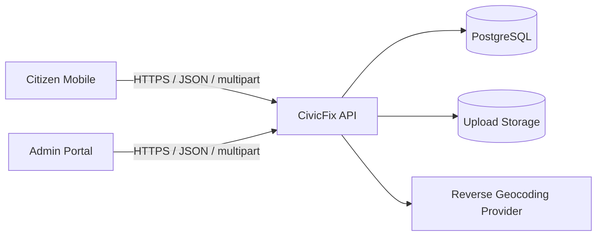
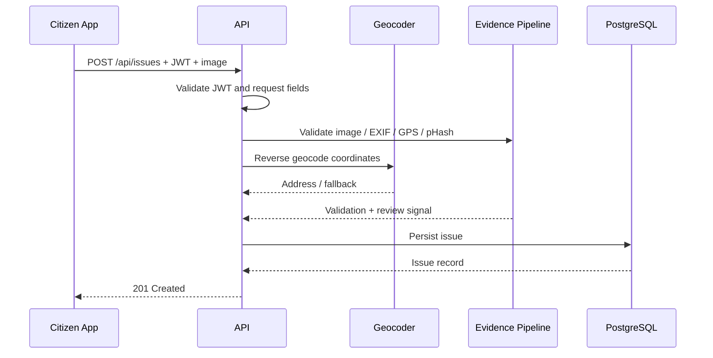
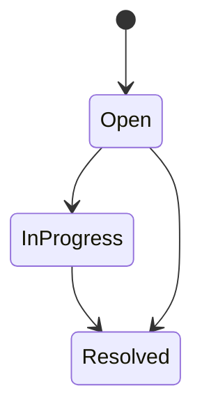
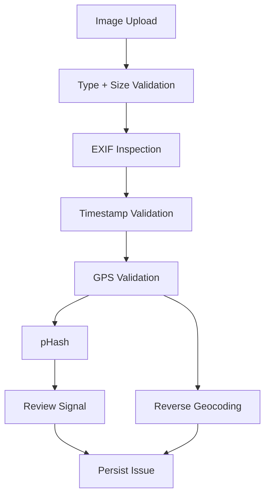
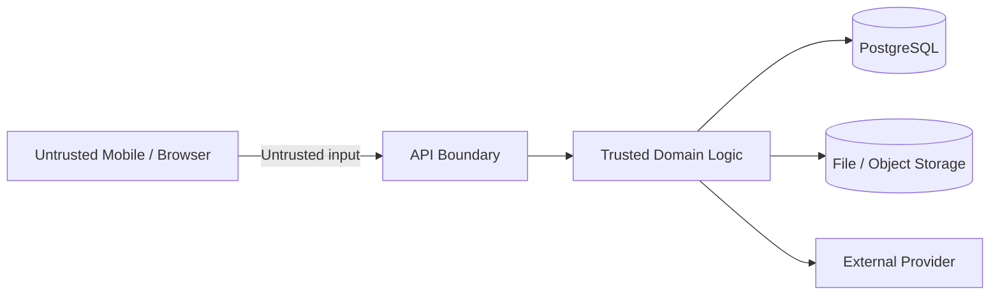
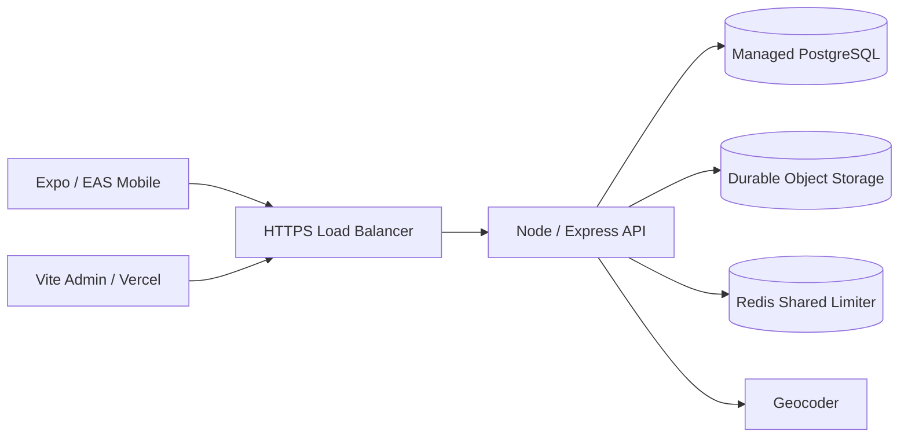

# Architecture Diagrams

The following Mermaid diagrams are intended to render in GitHub and documentation tooling that supports Mermaid.

## System context

## Issue submission sequence

## Issue lifecycle

The API can also accept a valid status directly for authorized staff/admin update requests; the state diagram represents the normal business progression rather than an exhaustive constraint on the current API.

## Evidence pipeline

## Trust boundaries

## Target deployment

The durable object storage and shared Redis nodes are target architecture elements for scaled production; the current repository still documents local uploads and process-local rate limiting as transitional limitations. fileciteturn255file0L2-L2
